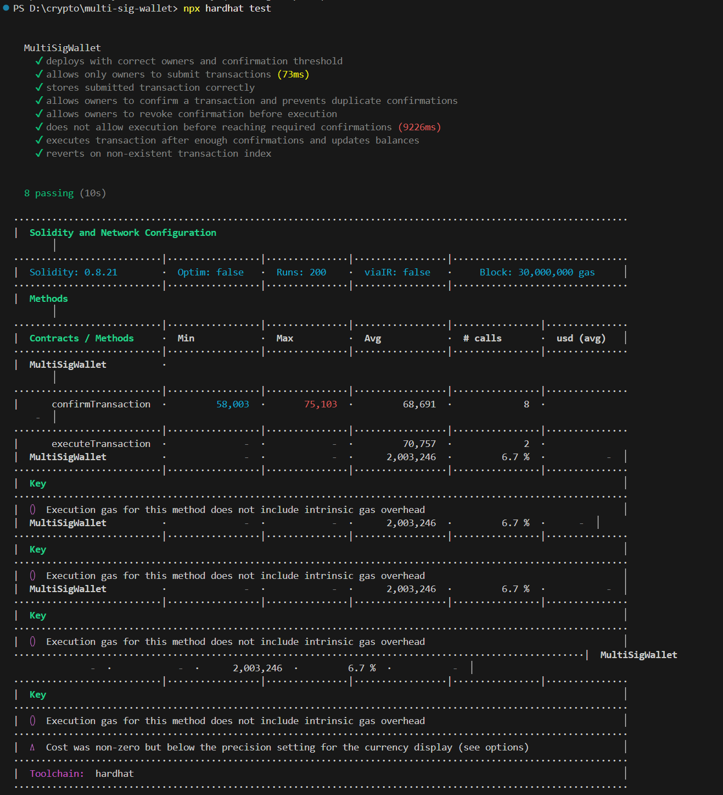
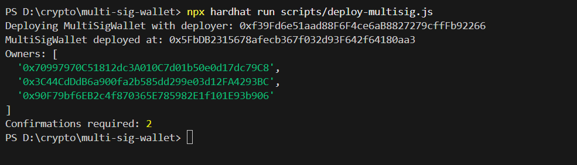

Multi-Signature Wallet – Documentation
1. Overview

A multi-signature (multi-sig) wallet is a smart contract that requires approval from multiple owners before executing a transaction. This design increases security by preventing a single compromised key from performing unauthorized actions. Multi-sig wallets are widely used in decentralized finance (DeFi), DAOs, and treasury management for secure and transparent fund control.

This project implements a simplified version of a multi-sig wallet inspired by well-known solutions such as Gnosis Safe and ConsenSys MultiSigWallet.
2. Contract Architecture
2.1 Owners and Access Control

The wallet is controlled by a predefined list of owners. The contract stores:

address[] public owners – list of all owners

mapping(address => bool) public isOwner – for fast ownership checks

uint public required – number of confirmations needed to execute a transaction

Only an owner is allowed to:

submit a transaction

confirm a transaction

revoke a confirmation

Ownership is static in this implementation. Adding or removing owners is not included.
3. Data Structures
3.1 Transaction Struct

Each proposed transaction is stored using:
struct Transaction {
    address to;
    uint value;
    bytes data;
    bool executed;
    uint numConfirmations;
}
Confirmations are tracked with:mapping(uint => mapping(address => bool)) public isConfirmed;
These structures allow the contract to enforce the multi-signature approval workflow.
4. Transaction Lifecycle
Submission

An owner submits a transaction using submitTransaction(). The contract stores the proposal and emits a corresponding event.

Confirmation

Other owners can approve the transaction using confirmTransaction().
Duplicate confirmations are prevented.

Revocation

Before execution, an owner may withdraw their confirmation using revokeConfirmation().

Execution

Once the number of confirmations reaches the required threshold, executeTransaction() performs the actual call:
(bool success, ) = tx.to.call{value: tx.value}(tx.data);
The transaction can only be executed once.
5. Events

The contract emits events to ensure transparency and support off-chain indexing:

SubmitTransaction

ConfirmTransaction

RevokeConfirmation

ExecuteTransaction

These events help track the complete transaction lifecycle.
6. Security Considerations

The implementation follows Solidity best practices.

Checks-Effects-Interactions Pattern

State updates are made before external calls to reduce reentrancy risk.

Duplicate Confirmation Prevention

Each owner can confirm a given transaction only once.

Access Control

All core functions are restricted to registered owners.

Execution Protection

A transaction cannot be executed more than one time.

Validation

The contract checks valid transaction indexes and prevents invalid operations.

Safe Ether Handling

Uses call{value: ...} which is recommended in Solidity 0.8 and later.

7. Testing Summary

The test suite includes coverage for:

correct deployment of owners and confirmation threshold

transaction submission

confirmation and revocation by multiple owners

execution only after reaching required approvals

preventing duplicate confirmations

rejecting actions from non-owners

handling of invalid transaction indexes

state changes and event emissions

All tests passed successfully, confirming correct behavior across standard and edge cases.
8. Deployment Instructions

To deploy the contract:
npx hardhat run scripts/deploy-multisig.js
The deployment script:

retrieves signers

deploys the multi-sig wallet

outputs contract address, owners, and required confirmations
9. Interaction Guide

Example interaction after deployment:

Submit a transaction
await multisig.submitTransaction(to, value, data);
Confirm a transaction
await multisig.confirmTransaction(txIndex);
Revoke a confirmation
await multisig.revokeConfirmation(txIndex);
Execute a transaction
await multisig.executeTransaction(txIndex);
10. Purpose and Impact of Multi-Sig Wallets

Multi-signature wallets address several key security and governance needs:

Prevention of single-key compromise

Collaborative decision-making for DAOs and teams

Secure treasury management

Protection against insider attacks

Improved transparency and accountability

This implementation demonstrates how multi-sig approval logic enhances the safety and reliability of decentralized applications.

